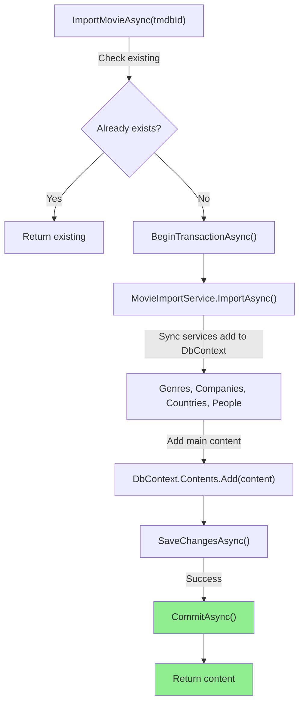
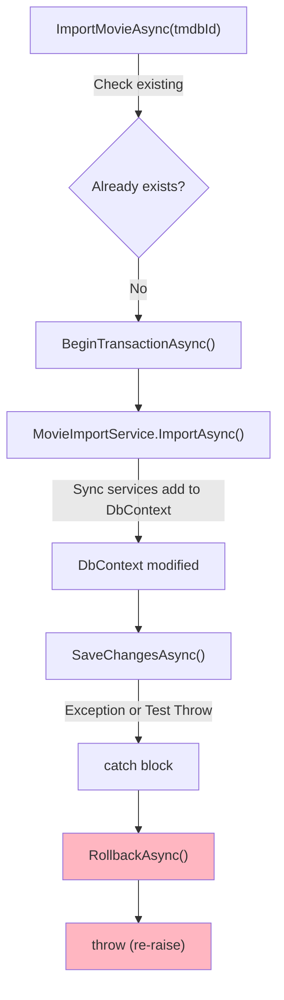

# ContentImportService - EF Core Transaction Implementation

## Architecture Overview

### Layered Approach

```
ContentController (HTTP endpoint)
	↓
ContentImportService (Transaction Orchestration)
	├─ BeginTransactionAsync()
	├─ MovieImportService.ImportAsync() ← DDD domain logic
	│   └─ Sync Services (Genre, Company, Country, Person)
	│       └─ DbContext.Add() only (no SaveChanges)
	├─ SaveChangesAsync() ← Single persistence point
	├─ CommitAsync() on success
	└─ RollbackAsync() on exception

WatchBookDbContext
	└─ SQL Server (Transaction scope)
```

## Transaction Flow

### Success Path


### Rollback Path


## Key Implementation Details

### 1. Three-Layer Service Separation

**ContentImportService** (Orchestration)
```csharp
public async Task<Content> ImportMovieAsync(int tmdbId, CancellationToken cancellationToken)
{
	// Transaction management
	await using var transaction = await dbContext.Database.BeginTransactionAsync(...);
	try
	{
		var content = await movieImportService.ImportAsync(...); // Delegate
		await dbContext.SaveChangesAsync(...); // Single save point
		await transaction.CommitAsync(...);
		return content;
	}
	catch
	{
		await transaction.RollbackAsync(...);
		throw; // Re-throw exception
	}
}
```

**MovieImportService** (Domain Logic)
```csharp
public async Task<Content> ImportAsync(int tmdbId, CancellationToken cancellationToken)
{
	// Get data from TMDb
	var movie = await movieClient.GetDetailsAsync(...);
	var credits = await movieClient.GetCreditsAsync(...);

	var content = MovieMapper.ToEntity(movie);

	// Sync related entities (only Add, no SaveChanges)
	foreach (var genreResponse in movie.Genres)
	{
		var genre = await genreSyncService.SyncAsync(...);
		content.ContentGenres.Add(new ContentGenre { Genre = genre });
	}

	// Similar for Companies, Countries, People

	dbContext.Contents.Add(content); // Don't save here!
	return content;
}
```

**SyncServices** (Entity Synchronization)
```csharp
public async Task<Genre> SyncAsync(GenreResponse response, CancellationToken cancellationToken)
{
	var existing = await dbContext.Genres
		.FirstOrDefaultAsync(x => x.TmdbId == response.Id, cancellationToken);

	if (existing is not null)
		return existing;

	var genre = new Genre { TmdbId = response.Id, Name = response.Name };
	await dbContext.Genres.AddAsync(genre, cancellationToken);
	// NO SaveChangesAsync here!
	return genre;
}
```

### 2. Transaction Guarantees

- **Atomicity**: All-or-nothing - entire import succeeds or all changes rollback
- **Consistency**: Database maintains referential integrity
- **Isolation**: Transaction doesn't interfere with concurrent requests
- **Durability**: Once committed, changes are permanent

### 3. Exception Handling

```csharp
catch
{
	// Automatic rollback of all pending changes
	await transaction.RollbackAsync(cancellationToken);

	// Re-throw to propagate error to caller (Controller)
	throw;
}
```

## Testing Rollback

### Test Scenario 1: Rollback Verification

**Setup**: Add temporary throw before CommitAsync
```csharp
await transaction.CommitAsync(cancellationToken);
// BEFORE: Add this line for testing
// throw new InvalidOperationException("TRANSACTION ROLLBACK TEST");
```

**Process**:
1. Call API: `POST /api/content/import/movie/550` (Fight Club)
2. Service executes import logic
3. SaveChangesAsync writes to DB within transaction
4. Throw occurs before CommitAsync
5. Exception caught → RollbackAsync executed
6. All changes reverted

**Verification**:
```sql
SELECT * FROM Contents WHERE TmdbId = 550; -- Should be 0 rows
SELECT * FROM ContentGenres WHERE ContentId IN (...); -- Should be 0 rows
```

**Expected**: All tables empty (rollback succeeded)

### Test Scenario 2: Normal Import

**Process**:
1. Remove the throw line
2. Rebuild application
3. Call API: `POST /api/content/import/movie/278` (Shawshank Redemption)
4. Service completes successfully
5. CommitAsync finalizes transaction
6. Changes persisted to database

**Verification**:
```sql
SELECT * FROM Contents WHERE TmdbId = 278; -- Should be 1 row
SELECT * FROM ContentGenres WHERE ContentId IN (...); -- Should be >=1 rows
SELECT * FROM ContentCompanies WHERE ContentId IN (...); -- Should be >=1 rows
SELECT * FROM ContentCountries WHERE ContentId IN (...); -- Should be >=1 rows
SELECT * FROM ContentPeople WHERE ContentId IN (...); -- Should be >=1 rows
```

**Expected**: All related records persisted successfully

## Benefits of This Architecture

| Benefit | Implementation |
|---------|-----------------|
| **Single Responsibility** | Each service has one purpose |
| **Testability** | Import logic can be tested independently |
| **Atomicity** | Transaction ensures all-or-nothing |
| **Error Recovery** | Automatic rollback on any exception |
| **Maintainability** | Clear separation of concerns |
| **Reusability** | Import services can be called from anywhere |
| **Performance** | Single SaveChangesAsync reduces DB round-trips |

## Files Modified

1. **ContentImportService.cs**
   - Added explicit transaction management
   - Calls MovieImportService and TvSeriesImportService
   - Single SaveChangesAsync for persistence
   - Proper commit/rollback handling

2. **MovieImportService.cs** (NEW)
   - Contains movie-specific import logic
   - Syncs all related entities
   - Returns content without persisting

3. **TvSeriesImportService.cs** (NEW)
   - Contains TV series-specific import logic
   - Handles seasons, episodes, and related data
   - Returns content without persisting

4. **SyncServices** (Unchanged)
   - Already removed SaveChangesAsync
   - Only Add/Update entities in DbContext
   - Idempotency maintained

## EF Core Best Practices Applied

✅ Explicit transaction management with `BeginTransactionAsync`  
✅ Single `SaveChangesAsync` at orchestration layer  
✅ Proper disposal with `await using` statement  
✅ Exception handling with rollback guarantee  
✅ CancellationToken propagation throughout  
✅ Repository pattern for data access  
✅ Dependency injection for services  
✅ Idempotent sync operations  

## References

- [EF Core Transactions](https://learn.microsoft.com/en-us/ef/core/saving/transactions)
- [BeginTransactionAsync Documentation](https://learn.microsoft.com/en-us/dotnet/api/microsoft.entityframeworkcore.databasefacade.begintransactionasync)
- [Database.Database.CommitTransactionAsync](https://learn.microsoft.com/en-us/dotnet/api/microsoft.entityframeworkcore.storage.itransaction.committasync)
